# 07 — Fluxo Arquitetural

## Fluxo principal

```mermaid
flowchart LR
    A[Ativo] --> B[Ameaça]
    B --> C[Vulnerabilidade]
    C --> D[Risco]
    D --> E[Impacto]
    E --> F[Controle preventivo]
    F --> G[Detecção]
    G --> H[Resposta]
    H --> I[Recuperação]
    I --> J[Lições aprendidas]
```

## Aplicação no cenário de credenciais

```mermaid
flowchart LR
    A[Credencial corporativa] --> B[InfoStealer ou phishing]
    B --> C[Senha fraca ou MFA vulnerável]
    C --> D[Sequestro de conta ou sessão]
    D --> E[Acesso a M365, ERP ou VPN]
    E --> F[FIDO2 e Conditional Access]
    F --> G[SIEM e UEBA]
    G --> H[SOAR revoga sessão]
    H --> I[EDR isola endpoint]
```

## Leitura do fluxo

1. Identifique o ativo.
2. Determine as ameaças relevantes.
3. Localize as vulnerabilidades.
4. Declare o risco de forma objetiva.
5. Traduza o impacto técnico para o negócio.
6. Selecione controles complementares.
7. Defina monitoramento, resposta e recuperação.
8. Registre riscos residuais e trade-offs.
