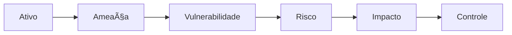

# 01.2 — Modelo Mental do Arquiteto de Segurança

> **Status:** ✅ Conteúdo inicial concluído  
> **Domínio:** Fundamentos  
> **Nível:** Foundation

## Objetivo do módulo

Desenvolver a capacidade de correlacionar ativos, ameaças, vulnerabilidades, riscos, impactos e controles arquiteturais.

## Conceitos fundamentais

### Ativo

Qualquer elemento que possua valor para a organização.

### Ameaça

Evento, agente ou condição com potencial de causar dano a um ativo.

### Vulnerabilidade

Fraqueza que pode ser explorada por uma ameaça.

### Risco

Possibilidade de uma ameaça explorar uma vulnerabilidade e causar impacto.

## Fluxo mental

## Exercício prático revisado

### Ativos identificados

**Pessoas**
- Funcionários
- Terceiros
- Parceiros
- Desenvolvedores
- Equipe Financeira
- Administradores

**Dados**
- Dados de clientes
- Dados financeiros
- Propriedade intelectual
- Credenciais
- Logs
- Dados da folha de pagamento

**Sistemas e serviços**
- Microsoft 365
- ERP
- Sistema financeiro
- VPN
- Active Directory
- Banco de Dados

**Infraestrutura**
- AWS
- Rede corporativa
- Servidores
- Firewalls
- DNS
- Endpoints

**Processos**
- Folha de pagamento
- Compras
- Produção
- Desenvolvimento de software
- Atendimento ao cliente

## Matriz de correlação arquitetural

| Ativo | Ameaças | Vulnerabilidades | Risco | Impactos para o negócio | Controles arquiteturais |
|---|---|---|---|---|---|
| Funcionários | Phishing; engenharia social | Baixa conscientização; reutilização de senhas | Comprometimento da identidade | Fraude, vazamento e perda de produtividade | Treinamento, MFA resistente a phishing, Conditional Access e EDR |
| VPN | Credential stuffing; credenciais roubadas | Ausência de MFA; software desatualizado | Acesso remoto não autorizado | Movimento lateral e exposição de dados | MFA, Device Trust, ZTNA, segmentação e SIEM |
| Banco de Dados | Ransomware; insider | Contas compartilhadas; patches atrasados | Exfiltração, alteração ou criptografia | Paralisação, LGPD e prejuízo financeiro | PAM, criptografia, auditoria, backup imutável e segmentação |
| Folha de Pagamento | Fraude interna; conta comprometida | Excesso de privilégios; ausência de SoD | Alteração indevida de pagamentos | Perda financeira e dano reputacional | IGA, SoD, múltipla aprovação, MFA e revisão de acessos |
| Credenciais | InfoStealer; phishing/AiTM | Senhas fracas; MFA não resistente a phishing | Sequestro de conta ou sessão | Acesso indevido a M365, ERP e VPN | FIDO2/WebAuthn, Conditional Access, SIEM/UEBA, EDR e SOAR |

## Estratégia arquitetural

- MFA resistente a phishing
- PAM para contas privilegiadas
- Conditional Access
- Revisões periódicas de acesso
- IGA e segregação de funções
- EDR/XDR
- SIEM para correlação
- SOAR para resposta automática
- ZTNA e Device Trust
- Segmentação de rede
- Backups imutáveis

## Como um arquiteto pensa

O arquiteto não trata apenas a credencial comprometida. Ele projeta controles em camadas para prevenir, detectar, limitar e responder ao ataque.

## Resumo executivo

O modelo mental do arquiteto conecta ativo, ameaça, vulnerabilidade, risco, impacto e controle para justificar decisões técnicas e de negócio.
