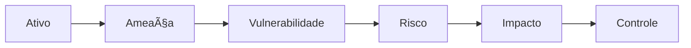

# 01.2 — Modelo Mental do Arquiteto de Segurança

> **Status:** Concluído  
> **Domínio:** Fundamentos  
> **Nível:** Foundation  
> **Tempo estimado:** 4 horas

## Objetivo

Desenvolver o raciocínio necessário para correlacionar ativos, ameaças, vulnerabilidades, riscos, impactos e controles antes de selecionar tecnologias.

## Ordem de estudo

1. [Conceitos fundamentais](01-Conceitos.md)
2. [Ativos](02-Ativos.md)
3. [Ameaças](03-Ameacas.md)
4. [Vulnerabilidades](04-Vulnerabilidades.md)
5. [Riscos e impactos](05-Riscos-e-Impactos.md)
6. [Controles de segurança](06-Controles.md)
7. [Fluxo arquitetural](07-Fluxo-Arquitetural.md)
8. [Como um arquiteto pensa](08-Como-um-Arquiteto-Pensa.md)
9. [Exercício prático resolvido](09-Exercicio-Pratico.md)
10. [Resumo executivo](10-Resumo-Executivo.md)

## Artefatos do módulo

- [Architecture Canvas](architecture-canvas.md)
- [ADR — Proteção de identidades em camadas](adr/ADR-0001-Protecao-de-Identidades-em-Camadas.md)
- [Diagrama do modelo mental](diagramas/01-Fluxo-Modelo-Mental.md)
- [Flashcards para Anki](flashcards/anki.csv)

## Modelo central

## Próximo módulo

**01.3 — Risco, Ameaça e Controle**
