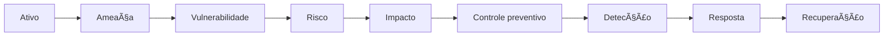

# Diagrama — Fluxo do Modelo Mental

```mermaid
flowchart LR
    A[Ativo] --> B[Ameaça]
    B --> C[Vulnerabilidade]
    C --> D[Risco]
    D --> E[Impacto]
    E --> F[Controle preventivo]
    F --> G[Detecção]
    G --> H[Resposta]
    H --> I[Recuperação]
```
